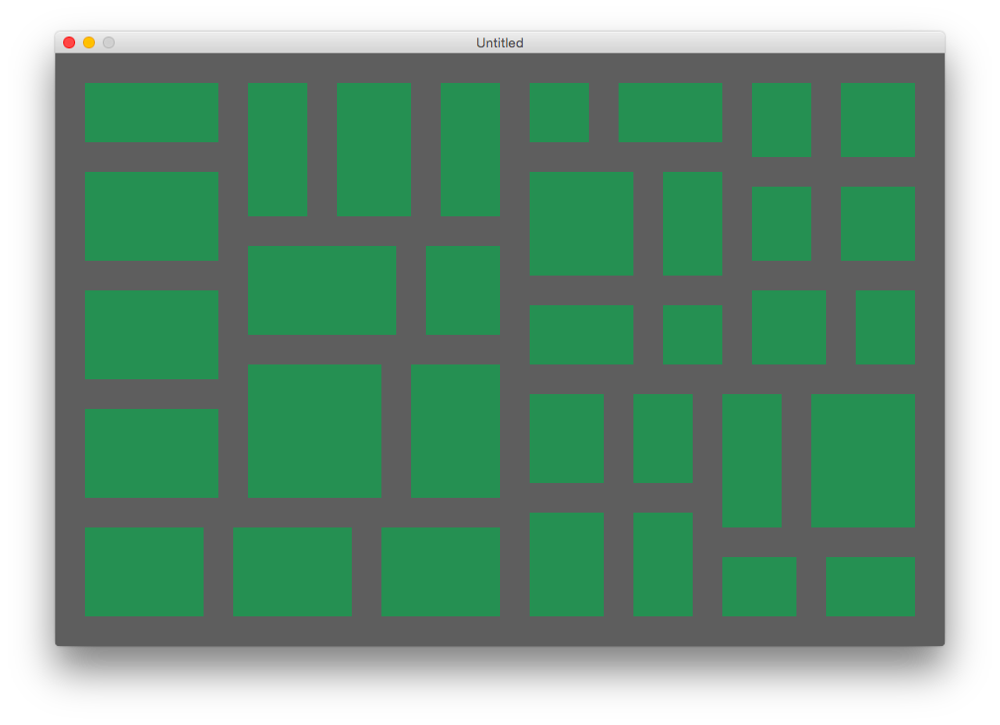

# 2DCityMaker
A 2D city map generator written in Lua.

### Installation

To make things easy the generator runs inside of [LÖVE 2D](https://love2d.org/). You'll need to download it and then drop this folder onto their app.

### Usage

The map generator makes use of a BSP Tree to subdivide the map into city blocks. You can customize the dimensions of the map as well as the width of the street lanes. The BSPNode class should stand on its own since it's priarily concerned with geometry and not graphics.

### Places to go

There are a few things that would make this generator more interesting

* Building generation
* Water features like lakes and rivers
* Address generation

### Contributions

If you add any features for your project then I'd love to get them back in the form of a pull request.

### License

Public Domain

